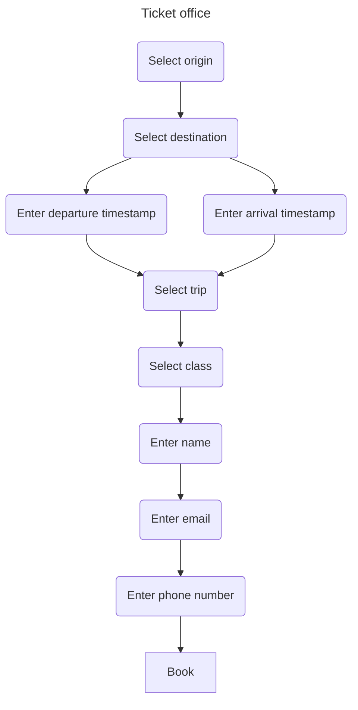

# Trash in, treasure out

By now, you're probably aware that at Mainmatter, we like Rust a lot. If you 
aren't: [have a look at our Rust page](https://mainmatter.com/rust-consulting/).
In this blog post, I'd like to highlight one of my favourite traits of Rust (yes 
pun intended): its focus on _correctness_. Rust has a very expressive type
system that lets you offload many checks to the compiler: it supports generics,
data-carrying enums, closures, visibility specifiers, _explicit_ conversions and
much more. Great features that make performant, low-level programming feel as
ergonomic as high-level languages. Sure, Rust has a learning curve, and that
learning curve is a result of Rust's tendency to make complexity really _in your
face_.

Make no mistake, every piece of software is complex: it has to run on
computers, which, especially nowadays are complex beasts. And writing
software with highly optimized languages with manual memory management like
C, C++ or Rust requires knowledge of all kinds of subtleties. Rust makes these
sublteties _explicit_, forcing you to fix all kinds of things you may never
have thought of before even compiling your code.

But that's not all: as projects grow and age and more people work on the same
piece of software, communication becomes very important. And by communication I
mean ensuring the original writer of some piece of code, the code reviewer, the 
user of the code's API, the colleague refactoring the codebase and new
developers are on the same page about the _intent_ and _invariants_ of that
code. What is this code doing? How am I supposed to use it correctly? What
happens if I mess up? How do I protect this API from input it might choke on?
Traditionally, one would write in documentation and code comments the answers
to these and many other questions. Writing documentation is a very valuable
job, but sadly, developers are human. And humans make mistakes. And if the
humans think they themselves don't make mistakes, they will surely agree
that their colleagues _do_.

Documentation written in human language needs to be clear, specific, and up to
date. And even if it's written well, for it to do its job, documentation needs
to be _read_ in the first place. And even if it _is_ read, it needs to be
interpreted and acted upon correctly. I don't know about you, but I'm way too
pendantic to see that go flawlessly.

Now, this is why I like Rust's expressive type system: it lets me encode a great
deal of the semantics I'd otherwise have to describe in the documentation. You
can craft your APIs and types such that using your library or module becomes
very hard or even impossible. You can encode the _intent_ and _invariants_
regarding your code using the type system. This way you get the Rust compiler
on _your_ side. It will be able to pick up subtle errors caused by your API
users holding it wrong. And it will do so _at compile time_, greatly shortening
the feedback loop. It makes adding features, refactoring, and reviewing much
less error-prone. And it's great for security as well. It's where coding meets
art, really.

In this article, I'd like to give four pieces of advice:
1. Encode the semantics/states of your application in the type system and your
  API.
2. Ensure input gets parsed into rigid structs before acceptance.
3. Ensure output gets encoded in the correct format and doesn’t leak (sensitive)
  information.
4. Ensure invalid state transitions are rejected at compile time.

## Ticket to heaven
We'll need a case to show how all this works, and since Mainmatter loves the
travel industry, let's write up an API for booking train tickets.

Looking at different train ticket services, in general the steps towards booking
are pretty similar: first, you enter the location you want to depart from and
where you want to go, then you enter either your preferred moment of departure
or when you want to arrive. Next you select one of a number of suggested trips
and enter your personal information. With all information complete, you're all
set to book the ticket and pay. Here's what that looks like as a flowchart:

