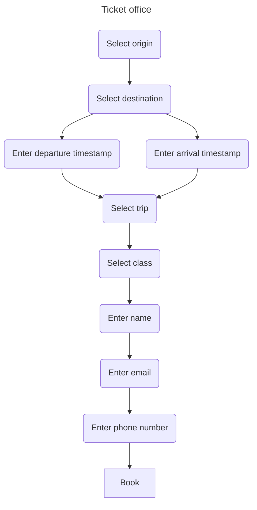

# Trash in, treasure out

By now, you're probably aware that at Mainmatter, we like Rust a lot. If you 
aren't: [have a look at our Rust page](https://mainmatter.com/rust-consulting/).
In this blog post, I'd like to highlight one of my favourite traits of Rust (yes 
pun intended): its focus on _correctness_. Rust has a very expressive type
system that lets you offload many checks to the compiler: it supports generics,
data-carrying enums, closures, visibility specifiers, _explicit_ conversions and
much more. Great features that make performant, low-level programming feel as
ergonomic as high-level languages. Sure, Rust has a learning curve, and that
learning curve is a result of Rust's tendency to make complexity really _in your
face_.

Make no mistake, every piece of software is complex: it has to run on
computers, which, especially nowadays are complex beasts. And writing
software with highly optimized languages with manual memory management like
C, C++ or Rust requires knowledge of all kinds of subtleties. Rust makes these
sublteties _explicit_, forcing you to fix all kinds of things you may never
have thought of before even compiling your code.

But that's not all: as projects grow and age and more people work on the same
piece of software, communication becomes very important. And by communication I
mean ensuring the original writer of some piece of code, the code reviewer, the 
user of the code's API, the colleague refactoring the codebase and new
developers are on the same page about the _intent_ and _invariants_ of that
code. What is this code doing? How am I supposed to use it correctly? What
happens if I mess up? How do I protect this API from input it might choke on?
Traditionally, one would write in documentation and code comments the answers
to these and many other questions. Writing documentation is a very valuable
job, but sadly, developers are human. And humans make mistakes. And if the
humans think they themselves don't make mistakes, they will surely agree
that their colleagues _do_.

Documentation written in human language needs to be clear, specific, and up to
date. And even if it's written well, for it to do its job, documentation needs
to be _read_ in the first place. And even if it _is_ read, it needs to be
interpreted and acted upon correctly. I don't know about you, but I'm way too
pendantic to see that go flawlessly.

Now, this is why I like Rust's expressive type system: it lets me encode a great
deal of the semantics I'd otherwise have to describe in the documentation. You
can craft your APIs and types such that using your library or module becomes
very hard or even impossible. You can encode the _intent_ and _invariants_
regarding your code using the type system. This way you get the Rust compiler
on _your_ side. It will be able to pick up subtle errors caused by your API
users holding it wrong. And it will do so _at compile time_, greatly shortening
the feedback loop. It makes adding features, refactoring, and reviewing much
less error-prone. And it's great for security as well. It's where coding meets
art, really.

In this article, I'd like to give four pieces of advice:
1. Encode the semantics/states of your application in the type system and your
  API.
2. Ensure input gets parsed into rigid structs before acceptance.
3. Ensure output gets encoded in the correct format and doesn’t leak (sensitive)
  information.
4. Ensure invalid state transitions are rejected at compile time.

## Ticket to heaven
We'll need a case to show how all this works, and since Mainmatter loves the
travel industry, let's write up an API for booking train tickets.

Looking at different train ticket services, in general the steps towards booking
are pretty similar: first, you enter the location you want to depart from and
where you want to go, then you enter either your preferred moment of departure
or when you want to arrive. Next you select one of a number of suggested trips
and enter your personal information. With all information complete, you're all
set to book the ticket and pay. Here's what that looks like as a flowchart:



Pretty straightforward, right? Let's code one up.

## Setting up
Let's set up a simple [`axum`]-based server to implement before flow. I'm only
going to post the code relevant to the story in here, but if you're interested
in the whole shebang: checkout the code for [step 0]. Here's what the app
setup looks like:

```rust
// src/lib.rs

pub async fn run() -> Result<()> {
    // Setup router
    let router = axum::Router::new()
        .route("/origin", post(set_origin))
        .route("/destination", post(set_destination))
        .route("/departure", post(set_departure))
        .route("/arrival", post(set_arrival))
        .route("/trips", get(list_trips))
        .route("/trip", post(set_trip))
        .route("/class", post(set_class))
        .route("/name", post(set_name))
        .route("/email", post(set_email))
        .route("/phone_number", post(set_phone_number))
        .route("/book_trip", post(book_trip));

    // Create in-memory session store
    let session_store: SessionNullSessionStore = SessionStore::new(None, SessionConfig::default())
        .await
        .unwrap();

    // Stitch them together
    let app = router
        .layer(SessionLayer::new(session_store))
        .into_make_service();

    // Aand serve!
    let listener = TcpListener::bind("0.0.0.0:3000").await?;
    axum::serve(listener, app).await?;

    Ok(())
}
```

As you can see, we've got routes for each step, as well as a basic in-memory
session store. For now, the handlers are pretty similar. Here's `set_origin`:

```rust
// src/lib.rs

async fn set_origin(session: Session, origin: String) -> Result<Json<TicketMachine>> {
    Ok(session.get_or_init_state(|s| {
        s.origin = Some(origin);
    }))
    .map(Json)
}
```

If you're not familiar with [`axum`]: this handler extracts the session out of
the session layer, and gives us the request body as a `String`.
`Session::get_or_init_state` fetches the current state from the session store,
and updates it with the closure passed to it. If there's no session yet, it
creates a default one, that it passes to the closure.

So what's this `TicketMachine` in the route handler example? Well, it's the
representation of the state of the booking flow. Here's the definition:

```rust
// src/ticket_machine.rs

#[derive(Debug, Default, PartialEq, Eq, serde::Deserialize, serde::Serialize)]
pub struct TicketMachine {
    pub origin: Option<String>,
    pub destination: Option<String>,
    pub departure: Option<String>,
    pub arrival: Option<String>,
    pub trip: Option<String>,
    pub class: Option<String>,
    pub name: Option<String>,
    pub email: Option<String>,
    pub phone_number: Option<String>,
}
```

Pretty much a bunch of optional strings. Does is work, though? Well, let's also
create a little integration test:

```rust
// tests/main.rs

#[tokio::test]
async fn test_set_origin() {
    let body: TicketMachine = send_post_request("/origin", "Amsterdam").await;
    assert_eq!(
        body,
        TicketMachine {
            origin: Some("Amsterdam".to_owned()),
            ..Default::default()
        }
    )
}
```

Nothing too surprising. The `send_post_request` helper function sends a HTTP
POST request to our server, given the path (`"/origin"`) and the body
(`"Amsterdam"`). Now, let's give it a spin. In one terminal window,
we start the server, and we'll run the tests in a separate terminal window:

```bash
// start server
$ cargo run
[..]
```

I'm using [`cargo-nextest`], because it gives me pretty and concise reports.

```bash
// Run tests
$ cargo nextest run
    Finished `test` profile [unoptimized + debuginfo] target(s) in 0.06s
------------
 Nextest run ID 2b617168-9190-4619-ba1d-27a3e6cdc815 with nextest profile: default
    Starting 1 test across 3 binaries
        PASS [   0.016s] takeoff::main test_set_origin
------------
     Summary [   0.017s] 1 test run: 1 passed, 0 skipped
```

> 1 test run: 1 passed

I like that!

## Looking back
Our route handler doesn't do a lot. It will accept any `String` for a body,
meaning that as far as our app is concerned `"🚂-🛒-🛒-🛒"` is totally a valid
origin. It's nice that, given a string [must be valid UTF-8], at least our
handler won't accept random byte sequences, but we can do better. For the
curious among you: the following code is in the [step 1] commit. Let's add some
validation:

```rust
// src/lib.rs

pub fn is_valid_location(location: &str) -> bool {
    const VALID_LOCATIONS: &[&str] = &[
        "Amsterdam Centraal",
        "Paris Nord",
        "Berlin Hbf",
        "London Waterloo",
    ];

    VALID_LOCATIONS.contains(&location)
}

// ✂️

async fn set_origin(session: Session, origin: String) -> Result<Json<TicketMachine>> {
    if !is_valid_location(&origin) {
        return Err(Error::BadRequest("Invalid origin!"));
    }

    Ok(session.get_or_init_state(|s| {
        s.origin = Some(origin);
    }))
    .map(Json)
}
```

Let's test some more:

```bash
$ cargo nextest run
Finished `test` profile [unoptimized + debuginfo] target(s) in 0.06s
------------
Nextest run ID 3437f17c-6fed-4b9b-8fad-27b324e45602 with nextest profile: default
Starting 1 test across 3 binaries
    FAIL [   0.014s] takeoff::main test_set_origin

--- STDOUT:              takeoff::main test_set_origin ---

<Omitted for your sanity>

--- STDERR:              takeoff::main test_set_origin ---
thread 'test_set_origin' panicked at tests/main.rs:34:9:
Received error response (reqwest::Error { kind: Status(400), url: "http://localhost:3000/origin" }): 'Bad Request: Invalid origin!'
note: run with `RUST_BACKTRACE=1` environment variable to display a backtrace

Cancelling due to test failure
------------
 Summary [   0.015s] 1 test run: 0 passed, 1 failed, 0 skipped
    FAIL [   0.014s] takeoff::main test_set_origin
error: test run failed
```

Yay! It fails! Turns out there's no station called "Amsterdam". We should update
the test again:

```rust
#[test_case(b"Amsterdam" => panics ""; "Non-existent station")]
#[test_case("🚂-🛒-🛒-🛒".as_bytes() => panics ""; "Emojional roller coaster")]
#[test_case(&[0xE0, 0x80, 0x80] => panics "" ; "Non-UTF-8 sequence")]
#[test_case(b"Amsterdam Centraal"; "Valid station")]
#[tokio::test]
async fn test_set_bad_origin(origin: &'static [u8]) {
    let body: TicketMachine = send_post_request("/origin", origin).await;
    assert_eq!(
        body,
        TicketMachine {
            origin: Some(String::from_utf8(origin.to_vec()).unwrap()),
            ..Default::default()
        }
    )
}
```

And those, believe me, totally pass! Now what?


[`axum`]: https://crates.io/crates/axum/
[`cargo-nextest`]: https://nexte.st/
[must be valid UTF-8]: https://doc.rust-lang.org/stable/std/string/struct.String.html
